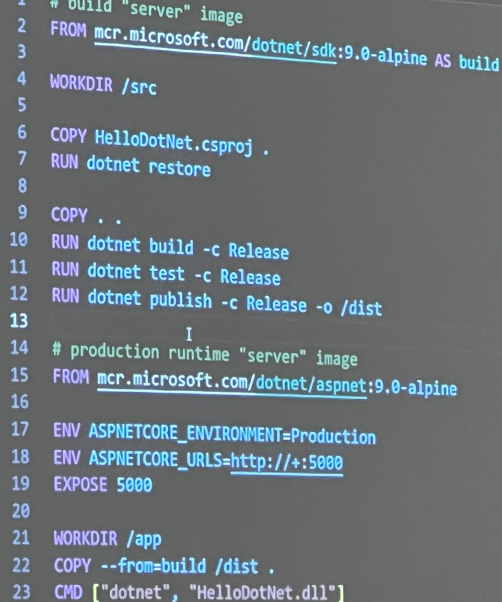

# Notes taken at KCDC.info 2025 and beyond

[Rob Richardson](https://github.com/robrich) is the workshop instructor.  Course makes no assumptions.   It's ok to move quickly through the docker parts or take your time there.  This repo is all of the courseware for today.

Three groups of info:
1. Docker
2. K8s
3. K8s in the cloud -- likely not getting there today, but it is in the courseware

Context -- docker is how we build containers, k8s is how we run them.

## Rob Richardson intresting involvements

1. [AZGive Camp](https://www.azgivecamp.org/) -- coding for charity
1. redgate -- community ambasador
1. Cy ambassador

## containers are
1. ephemeral (short-lived)
1. isomorphic (unchaging)
1. deterministic (same every time)

This makes them a good way for development & operation departments to communicate.

## Some follow along

1. `docker run -p <host_port>:<container_port> <image_name>`
1. docker container list --all 
1. docker container stop 6af
1. docker container

## Big commands
1. FROM - main command
2. COPY - main command
3. RUN - main command
4. ENV
5. CMD - main command

## hub.docker.com is a place to find images
1. Therre's a "Docker Official Image" that is node.  

## .dockerignore
1. Downloaded files
   1. node_modules
1. built files
   1. bin
   2. obj
   3. dist
1. user-specfic files
   1. .vs
   2. *.suo
1. temp files
   1. *.tmp
   2. .DS_Store
   3. .zip
1. secrets
   3. `.env`
1. non-production files
   1. Dockerfile
   2. .dockerignore
   3. k8s.yaml
   4. appsetttings.*.json
   4. **/launchSettings.json

### Note `!filenamePattern` is an exception

## Docker is an ecosystem around container virtualization.  

# Tips
1. Changing the `Dockerfile` requires rebuilding the docker container before you run the new docker container.
1. Containers tools extension for VS Code is good.
1. `docker container rm -f abc` will stop and remove
1. [.NET Aspire dashboard](https://learn.microsoft.com/en-us/dotnet/aspire/fundamentals/dashboard/overview?tabs=bash) is cool.  IDK why instructor said that.

## Use layers 
1. to make secure  -- don't put compile tools in the image
2. do expensive operations only once

# Break then chapters 2 through 5

1. service mesh exists is sorta a 300 level thing
1. stateful workloads is a 200 level thing
2. helm is sorta a 200 level thing.
1. TIL that `Docker Official Image` exits on https://hub.docker.com/
1. https://artifacthub.io/ is a good way to distribute helm files.
1. https://opentelemetry.io/ is cool
   1. Aspire is good search: .NET Aspire https://hub.docker.com/r/microsoft/dotnet-aspire-dashboard  `docker pull mcr.microsoft.com/dotnet/aspire-dashboard:9.3`
      1. logs
      2. Traces
      3. Metrics
   1. aspire:4318 is a common collection URL
1. k8s daemon sets keep track of health of a node and virtual machine.

# After lunch
1. TIL https://docs.docker.com/scout/ exists
1. `docker sbom image` is one way to build an SBOM
1. SQL Server can & MS says should be run in a container.  

## `kubectl` is a good cli
1. Send commands to k8s

a11y -- accesilbilty
i18n -- internationalization

Search kubeadm or look to kubernetes.io/docs/setup

This class takes the view of k8s developers, not k8s administrators.  

### k3s -- is an easier and simiplier way to k8s

### k0s -- ulitimate lightweight k8s is new

# More trying to follow along
1. `kubectl config use-context docker-desktop` is important
1. `kubectl get all`
2. `kubectl apply -f pod.yaml`
1. `kubectl get all`
1. `kubectl describe pod/nginx`

# Learning
1. https://www.reddit.com/r/kubernetes/comments/83krnb/exercises_to_learn_kubernetes/
1. https://learnkube.com/ is likely not free.

